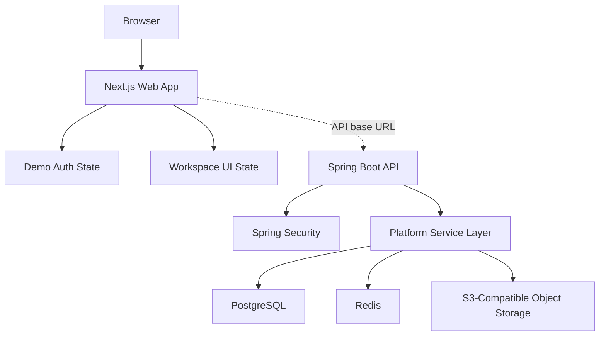

# Architecture

## System Overview

AuroraPM is split into a Next.js frontend and a Spring Boot backend. The frontend is currently deployed as a production demo on Vercel. The backend, database schema, Docker configuration, and Kubernetes manifests are included for full-stack deployment.

## Frontend Architecture

Location: `apps/web`

Key files:

- `src/app/page.tsx`: application entry
- `src/app/layout.tsx`: HTML shell and metadata
- `src/app/globals.css`: visual design system
- `src/components/EnterpriseDashboard.tsx`: authenticated demo workspace
- `src/lib/platform.ts`: typed domain data, auth helper, search, analytics, task movement

Frontend responsibilities:

- Render login/logout flow
- Validate demo credentials
- Render organization, teams, projects, tasks, sprints, calendar, files, comments, notifications, activity, search, and analytics
- Provide interactive Kanban movement
- Provide deterministic demo data for a deployable frontend experience

## Backend Architecture

Location: `services/api`

Key packages:

- `controller`: REST endpoints
- `service`: seeded platform behavior and mutations
- `dto`: API request and response models
- `config`: Spring Security configuration
- `resources/db/migration`: PostgreSQL schema

Backend responsibilities:

- Demo login endpoint
- Protected workspace endpoints
- Task status update endpoint
- Comments endpoint
- Search endpoint
- Analytics endpoint
- Upload presign contract

## Data Model

The PostgreSQL migration defines:

- `organizations`
- `teams`
- `projects`
- `sprints`
- `tasks`
- `comments`
- `file_assets`

Important relationships:

- Teams belong to organizations.
- Projects belong to organizations and teams.
- Sprints belong to projects.
- Tasks belong to projects and optionally sprints.
- Comments belong to tasks.
- File assets belong to projects.

## Authentication and Authorization

Current demo:

- Frontend demo accounts are validated in `src/lib/platform.ts`.
- Backend `/api/auth/login` accepts only the documented admin/member demo accounts.
- Backend protected routes use Spring Security HTTP Basic.

Production recommendation:

- Replace demo credentials with OAuth/OIDC.
- Validate JWTs or opaque access tokens in Spring Security.
- Add tenant-scoped permissions for organization, project, team, task, and file operations.

## Cache Layer

Redis is included as a configured runtime dependency. Production use cases:

- Notification fan-out state
- Search result caching
- Session metadata
- Rate limiting
- Activity feed hydration

## Storage Layer

S3-compatible storage is represented by:

- `POST /api/uploads/presign`
- `UploadRequest`
- `UploadResponse`
- S3-style storage keys in the frontend demo

Production use cases:

- Presigned PUT URLs
- Tenant-aware object keys
- Malware scanning workflow
- Retention policy and lifecycle rules

## Deployment Architecture

Local:

- `docker-compose.yml` starts PostgreSQL, Redis, MinIO, API, and web.

Production:

- `infra/k8s` contains namespace, config map, secrets example, PostgreSQL, Redis, API, web, ingress, and HPA manifests.
- `infra/k8s/kustomization.yaml` is used by CI to render manifests.

## CI Architecture

GitHub Actions workflow:

- Web checks
- API checks
- Kubernetes manifest render
- Docker image builds

The CI pipeline validates that the repo can build on a clean runner.
 